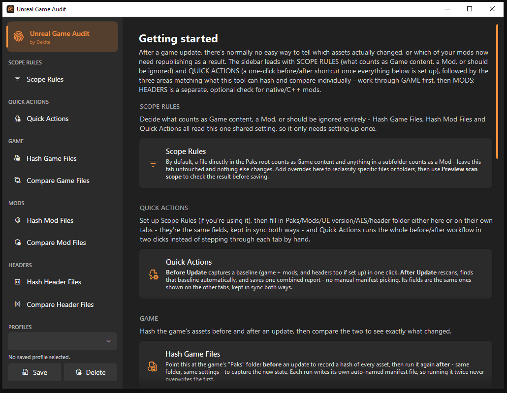

<div align="center">

# Unreal Game Audit
### *by Dekita*

**Hash and compare Unreal Engine game assets across updates - know exactly what changed, and which of your mods need republishing.**



</div>

## What it does

After a game update, there's normally no easy way to tell which assets actually changed, or which mods now
need republishing as a result. This tool uses [CUE4Parse](https://github.com/FabianFG/CUE4Parse) to hash
every asset in a game's paks (`.pak` and IoStore `.utoc`/`.ucas`) on its fully decompressed/decrypted bytes -
so pak compression settings or re-encryption between builds never show up as a false change, only real
content does. Comes as both a desktop **GUI** and a **CLI** (for scripting) - same logic either way.

## Features

- **Hash & compare game assets** - an exact list of added/removed/changed assets between two builds.
- **Hash & compare mods** - cross-reference against a game comparison to get a plain "these mods need
  updating" report. Only inspects file paths, not content, so it's fast and doesn't need the game files at all.
- **Optional native/C++ tracking** - hash [UE4SS](https://github.com/UE4SS-RE/RE-UE4SS)'s reconstructed C++
  header dumps to catch memory-layout breaks (a `UPROPERTY` shifting offset) and source-level changes, not
  just asset changes.
- **Quick Actions** - one click to capture a before/after baseline and run every comparison, no manual
  manifest picking.
- **Scope Rules** - classify Paks content as Game/Mod/Ignore (`~mods`, `LogicMods`, custom subfolders) without
  relying on a specific folder name.
- **Profiles** - save/switch named field sets per game; the AES key is DPAPI-encrypted at rest.
- **Cancel-able, resumable-feeling** - every hash/compare/Quick Action can be cancelled mid-run without
  corrupting anything.

## Getting started (GUI)

1. Grab `DekUnrealGameAudit.Gui.exe` from a packaged release (or build it yourself - see
   [For developers](#for-developers)).
2. Open it, pick **Hash Game Files**, and fill in your game's Paks folder + UE version.
3. Run it before an update, and again after - each run writes its own timestamped manifest.
4. Open **Compare Game Files**, point it at the two manifests, and see exactly what changed.

The in-app **Guide** tab (the default landing page) walks through every tab in the sidebar in the same order
they're laid out. The rest of this section covers what's not obvious from using it.

<details>
<summary><strong>More about the GUI</strong> - profiles, Quick Actions, Scope Rules, settings storage</summary>

All sections share one settings object, so switching sections never loses an edit. It's auto-loaded on
startup and auto-saved both when a scan finishes and when you close the window. The **Profile** picker at the
bottom of the sidebar saves the current fields under a name and switches between named profiles later (handy
for one profile per game) - pick a name to apply it, type a new one and click save to add it, or delete to
remove it. Saving over an existing profile asks for confirmation, and a modified-but-unsaved profile is
flagged in the sidebar before you switch away from it.

Both the auto-saved "current" state and all named profiles live in `%LocalAppData%\DekUnrealGameAudit\`
(`gui-settings.json`/`profiles.json`) rather than next to the exe, so they aren't swept up if you zip up
`Output\` to share. The AES key field is additionally encrypted at rest with Windows DPAPI (current-user
scope) - a leaked/shared copy of either file doesn't hand over a real decryption key. If Windows can't encrypt
the key, the app warns rather than silently dropping it.

**Quick Actions** automates the normal update workflow: **Before Update** captures and activates a complete
game/mod/header baseline; **After Update** rescans, finds that baseline automatically, and writes one combined
report plus a diagnostic log. **Scope Rules** previews which recursively discovered containers are treated as
game, mod, or ignored content - supports `~mods`, `LogicMods`, custom subfolders, and root-level exceptions.

Each Compare tab shows a counts-first, searchable/filterable result list alongside the full text log (the log
alone doesn't scale to tens of thousands of entries), plus an **Export Markdown** button once a run finishes.
UE version is a searchable dropdown of every `EGame` name CUE4Parse supports (~260 of them); AES key accepts
multiple keys, one per line. Every input is disabled while its own scan runs, and every scan/compare/Quick
Action has a **Cancel** button that stops at the next safe checkpoint without publishing a partial result.

</details>

## Getting started (CLI / `.bat` scripts)

The easiest CLI path is the `.bat` launchers in [`Scripts\`](Scripts) (same idea as
[DekPakModAudit's own launcher scripts](https://github.com/Dekita/DekPakModAudit/blob/master/audit-mods-only.bat)),
packaged into `Output\CommandLineTool\` alongside the CLI exe:

1. Copy **`settings.bat`** to **`settings.local.bat`** next to it, then fill in `PAKS_FOLDER`, `MODS_FOLDER`,
   `UE_VERSION` (and `AES_ARGS` if encrypted). Every script picks this up automatically instead of
   `settings.bat`'s blank defaults, keeping your real paths/key out of the file committed to source control.
2. Double-click `hash-game-files.bat` before a game update, and again after - each run auto-names its own
   output and prints the full path.
3. Paste those two paths into `OLD_GAME_MANIFEST`/`NEW_GAME_MANIFEST`, then run `compare-game-files.bat`.
4. Run `hash-mod-files.bat` any time to (re)scan your mods - independent of the timing above.
5. Run `compare-mod-files.bat` for a plain "these mods need updating" report.

Steps 6-8 are optional, only relevant for native/C++ mods that read UE4SS's own header dumps (see
[CLI reference](#cli-reference) below):

6. Fill in `UE4SS_FOLDER`, then run `hash-header-files.bat` before and after an update, same idea as step 2.
7. Paste the two printed paths into `OLD_HEADER_MANIFEST`/`NEW_HEADER_MANIFEST`.
8. Run `compare-header-files.bat` for a report of memory-layout breaks and source-level changes.

Re-running any step is always safe - each `compare-*`/`hash-mod-files` script overwrites its own fixed output
file, and `hash-game-files`/`hash-header-files` auto-name a fresh file every time.

## CLI reference

```
DekUnrealGameAudit hash-game-files      --paks <folder> --ue-version <EGame name> [--aes GUID:HEXKEY]... [--aes-file keys.txt] [--version-tag text] [--out manifest.json] [--max-parallelism N]
DekUnrealGameAudit compare-game-files   --old old-manifest.json --new new-manifest.json --out comparison.json [--md report.md]
DekUnrealGameAudit hash-mod-files       --mods <folder>... --ue-version <EGame name> [--aes GUID:HEXKEY]... [--aes-file keys.txt] [--out mods-manifest.json]
DekUnrealGameAudit compare-mod-files    --diff comparison.json --mods mods-manifest.json [--out report.json] [--md report.md]
DekUnrealGameAudit hash-header-files    --ue4ss <folder> [--out header-manifest.json]
DekUnrealGameAudit compare-header-files --old old-headers.json --new new-headers.json --out header-comparison.json [--md report.md]
DekUnrealGameAudit before-update        --paks <folder> --mods <folder>... --ue-version <EGame name> --out <run folder> [shared scan options]
DekUnrealGameAudit after-update         --paks <folder> --mods <folder>... --ue-version <EGame name> --out <run folder> [shared scan options]
```

```bash
# Typical workflow
DekUnrealGameAudit hash-game-files --paks "C:\Game\Content\Paks" --ue-version GAME_UE5_3 --out manifests\v1.0.json
DekUnrealGameAudit hash-mod-files  --mods "C:\Game\Content\Paks\~mods" --ue-version GAME_UE5_3 --out manifests\mods.json
# ...after the game updates...
DekUnrealGameAudit hash-game-files --paks "C:\Game\Content\Paks" --ue-version GAME_UE5_3 --out manifests\v1.1.json
DekUnrealGameAudit compare-game-files --old manifests\v1.0.json --new manifests\v1.1.json --out manifests\comparison.json
DekUnrealGameAudit compare-mod-files  --diff manifests\comparison.json --mods manifests\mods.json --md manifests\report.md
```

Every command can be interrupted with Ctrl+C and exits without publishing its pending output. `--mods` (on
`hash-mod-files`, `before-update`, `after-update`) may be repeated to scan several mod roots in one run -
containers reachable from more than one root are only ever hashed once. The GUI's Mods folder box accepts the
same thing as one folder per line.

<details>
<summary><strong>Flag details</strong> - <code>--ue-version</code>, AES keys, UE4SS header dumps, auto-naming</summary>

**`--ue-version`** must be an exact `EGame` enum member name from CUE4Parse, e.g. `GAME_UE5_3`, `GAME_UE4_26` -
see the full list in [EGame.cs](https://github.com/FabianFG/CUE4Parse/blob/master/CUE4Parse/UE4/Versions/EGame.cs).
Same identifier tools like FModel use.

**AES keys** are only needed if the paks are encrypted. Provide one or more `--aes GUID:HEXKEY` flags, or a
bare `--aes HEXKEY` for a single main key (implies the all-zero GUID CUE4Parse/FModel use by convention). For
several keys, use `--aes-file keys.txt` (one `guid=hexkey` pair per line, `#` for comments), or in the GUI,
one `GUID:HEXKEY`/bare `HEXKEY` per line.

**UE4SS header dumps** (`hash-header-files`/`compare-header-files`, native/C++ mods only): UE4SS can dump a
reconstructed C++ SDK next to its own DLL, as two sibling folders `--ue4ss` should point at the *parent* of:
- **`CXXHeaderDump\`** - every reflected type's members with exact memory offset/size - the authoritative
  source for *breaking* changes (a mod reading a class by raw offset silently reads/writes the wrong bytes if
  a `UPROPERTY` shifted). Flagged as `OffsetShifted` (⚠) in the comparison.
- **`UHTHeaderDump\<Module>\Public\<Type>.h`** - the same types as readable headers, useful for *semantic*
  changes (Blueprint exposure, a function gaining a parameter) even when memory layout didn't move.

`hash-header-files` parses whichever folder(s) exist; `compare-header-files` reports both kinds of change
separately, and `--md` renders one combined report. A single unreadable file is logged and skipped, not fatal.

**Auto-naming**: `--out` is optional everywhere except `compare-*` and `before-update`/`after-update` - left
off, `hash-game-files` auto-names `game-manifest-<version>-<date>-<random>.json` (version from
`--version-tag`, or best-effort detection from the game's own `DefaultGame.ini`), and `hash-mod-files`/
`hash-header-files` auto-name similarly without a version segment. An explicit `--out` is always used as-is.
`compare-mod-files --out` is optional too (the console summary/`--md` report can stand alone), but its
`--diff`/`--mods` inputs are required since later stages consume them as machine-readable input.

</details>

<details>
<summary><strong>Output file shapes</strong></summary>

- **Game manifest**: `{ detectedGameVersion, versionTag, assets: { "<path>": { hash, size } } }`.
- **Mods manifest**: `{ mods: { "<pak/utoc container name>": { assets: ["<path>", ...] } } }`.
- **Game comparison**: `{ added, removed, changed: [{ path, oldHash, newHash }], unchangedCount }`, plus a
  Markdown report with `--md`.
- **Mod comparison**: `{ mods: { "<container>": { affectedAssets, needsUpdate } } }`, plus a console summary
  and, with `--md`, a table you can paste into a Discord/forum post.
- **Header manifest**: `{ cxxTypes: {...}, cxxEnums: {...}, uhtTypes: {...} }`.
- **Header comparison**: separate CXX (layout) and UHT (source) sections, each with
  `addedTypes`/`removedTypes`/`changedTypes`/`unchangedTypeCount`; a changed CXX type's `fieldChanges` include
  `changeType: "OffsetShifted"` for the memory-breaking case.

A mod is identified by its pak/utoc **container name** (same approach as
[DekPakModAudit](https://github.com/Dekita/DekPakModAudit)) - if two different mods share a container name,
their assets merge into one reported entry and `hash-mod-files` warns about it; rename one pak to tell them
apart. `compare-game-files` also warns (but still produces a result) if the two manifests don't share a UE
version - usually a sign you compared manifests from two different games.

</details>

## For developers

<details>
<summary><strong>Building &amp; running from source</strong></summary>

Requires the .NET 10 SDK. Run from the repo root:

```bash
dotnet build Source/DekUnrealGameAudit.csproj
dotnet run --project Source/DekUnrealGameAudit.csproj -- hash-game-files --paks ... --ue-version ...

dotnet build Source/Gui/DekUnrealGameAudit.Gui.csproj
dotnet run --project Source/Gui/DekUnrealGameAudit.Gui.csproj
```

Uses CUE4Parse `1.2.2.202609`, a dated build tracking new games/fixes more closely than the last stable
`1.2.2` release (which only targets `net8.0`). Bump the `CUE4Parse` package version for newer game support;
check `Microsoft.Bcl.Memory`'s pinned version (see the security note in the `.csproj`) still matches what
CUE4Parse pulls in transitively when you do.

Hashing reads assets in parallel via CUE4Parse's positional `ReadAt` API against a shared, already-open
container handle - verified byte-identical to a sequential run on a real ~1M-asset game, and ~2.4x faster.
Deliberately avoids CUE4Parse's own `IsConcurrent`/clone-per-read mechanism, which reopens the file from disk
on every read and measured far slower.

</details>

<details>
<summary><strong>Testing</strong></summary>

```bash
dotnet test Source/Tests/DekUnrealGameAudit.Tests.csproj
```

Covers the parsers, compare engines, Quick Action branching, settings snapshots, and DPAPI wrapper failure
behavior. It doesn't mount real game paks or exercise WPF interactions, which still need a live game/UE4SS
dump and a manual GUI pass. `package.bat` runs this suite before publishing and smoke-testing both exes.

</details>

<details>
<summary><strong>Packaging a standalone .exe</strong></summary>

Run `package.bat` (same approach as
[DekPakModAudit's own package.bat](https://github.com/Dekita/DekPakModAudit/blob/master/package.bat)):

```bash
package.bat
```

Publishes both `DekUnrealGameAudit.exe` (CLI, ~75 MB) and `DekUnrealGameAudit.Gui.exe` (GUI, ~150 MB) as
self-contained single files - no separate DLLs, no .NET install required on the target machine.
`DekUnrealGameAudit.Gui.exe` lands at the root of `Output\`; the CLI exe, `settings.bat`, and the launcher
scripts go into `Output\CommandLineTool\` together (the scripts find the exe next to themselves at runtime).
`Build\` isn't deleted automatically (an IDE's background build can hold a file open) - delete it yourself
whenever you like, since everything `Output\` needs has already been copied out.

If restore fails with 404s from a source literally named `https://nuget.org` (missing `api.`/`/v3/index.json`),
that's a stale bad source in your machine-wide `NuGet.Config` (`%APPDATA%\NuGet\NuGet.Config`) - remove it, or
pass `--ignore-failed-sources` (which `package.bat` already does).

</details>

<details>
<summary><strong>Project layout</strong></summary>

```
package.bat                                       - dev-only: builds both standalone .exes
Source/
  DekUnrealGameAudit.csproj, Directory.Build.props - CLI project files
  Program.cs                                       - CLI entry point
  Commands/                                        - one file per CLI verb, plus the flag parser
  Core/                                            - provider setup, hashing, JSON models -
                                                       shared by the CLI and the GUI
  Gui/                                             - the WPF GUI, a separate project that
                                                       references the above directly
    DekUnrealGameAudit.Gui.csproj, Directory.Build.props
    App.xaml(.cs), MainWindow.xaml(.cs), AppSettings.cs
    ProfileStore.cs, DpapiProtect.cs, WindowGeometry.cs
    SharedField.cs, SharedFieldValidation.cs, EGameComboBox.cs
    ScopeRulesLoader.cs, AccessibilityAnnouncer.cs, LogViewHelper.cs
    OperationUiHelpers.cs, CompareResultRow.cs, CompareResultsPanel.cs
    Assets/app.ico                                 - window/taskbar icon
    Views/                                         - one UserControl per sidebar section
  Tests/                                           - xUnit coverage for Core (see Testing above)
    DekUnrealGameAudit.Tests.csproj, Directory.Build.props
Scripts/                                          - end-user launcher scripts (see Getting started above)
docs/                                              - README assets
Build/, Output/, test-output/                     - all gitignored; Build/ is ordinary compiler output,
                                                     Output/ is package.bat's assembled deliverable,
                                                     test-output/ is scratch space for your own manifests
```

Both project files live alongside the code they build, but `Build\`/`Output\` land at the repo root - each
project has its own `Directory.Build.props` setting `BaseOutputPath`/`BaseIntermediateOutputPath` with enough
`..\`s to climb back up (MSBuild resolves relative paths against the project file's own directory). They're
separate small files rather than shared, since WPF's temporary shadow project for XAML compilation broke a
shared path computed from `$(MSBuildProjectName)`. The GUI is a separate project (not a dual CLI/GUI exe)
because WPF needs a Windows-specific TFM (`net10.0-windows7.0`), keeping the CLI project a plain `net10.0`
console app untouched.

</details>
